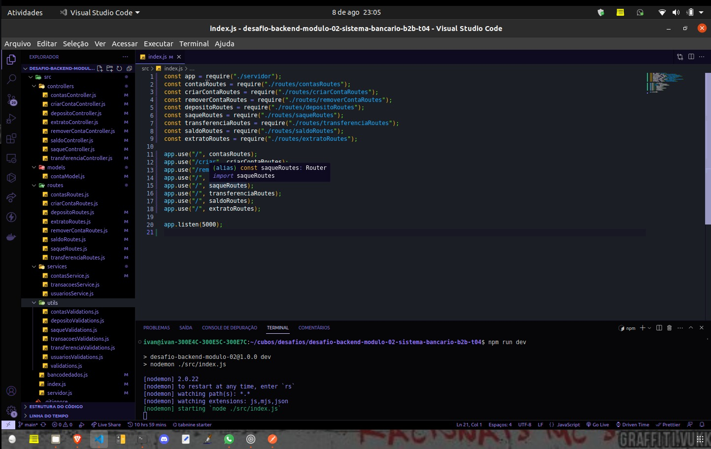

# API em Node.js - Banco Digital Cubos

Esta é uma API simples de um banco digital desenvolvida em JavaScript com Node.js. A API utiliza HTTP para comunicação e os dados são formatados em JSON. Ela fornece funcionalidades básicas de um banco digital, incluindo a criação de contas, operações bancárias, consulta de saldo e emissão de extrato.

## 🚀 Funcionalidades

- Criar conta bancária
- Listar contas bancárias
- Atualizar os dados do usuário da conta bancária
- Excluir uma conta bancária
- Depósitar em uma conta bancária
- Sacar de uma conta bancária
- Transferir valores entre contas bancárias
- Consultar saldo da conta bancária
- Emitir extrato bancário

## 💻 Tecnologias utilizadas

- JavaScript
- Node.js
- Express.js
- HTTP e JSON
- NPM (Node Package Manager)
- Git

## ✨Endpoints

- GET /contas?senha_banco=Cubos123Bank
- POST /contas
- PUT /contas/:numeroConta/usuario
- DELETE /contas/:numeroConta
- POST /transacoes/depositar
- POST /transacoes/sacar
- POST /transacoes/transferir
- GET /contas/saldo?numero_conta=1&senha=1234
- GET /contas/extrato?numero_conta=1&senha=1234

## 🏁 Considerações Finais

Esta API de banco digital fornece funcionalidades essenciais para a gestão de contas bancárias e operações financeiras.

---

# Projeto Desafio do módulo 2 do PotênciaTech 🚀

## Sobre o Projeto

Esse é o projeto do desafio do módulo 2 do PotênciaTech, um curso de desenvolvimento backend em parceria com o Ifood e a Cubos Academy. O projeto consiste em criar uma API para um sistema bancário com funcionalidades como criar conta, realizar depósitos, saques, transferências, e muito mais.

## Tecnologias Utilizadas

- Node.js
- Express.js
- JavaScript

## Funcionalidades

- Criar conta bancária
- Consultar saldo
- Realizar depósitos
- Realizar saques
- Fazer transferências
- Visualizar extrato
- E mais!

## Como Executar

1. Clone o repositório para sua máquina
2. Instale as dependências com `npm install`
3. Execute o servidor com `npm start`
4. Acesse a API através de `http://localhost:5000`

